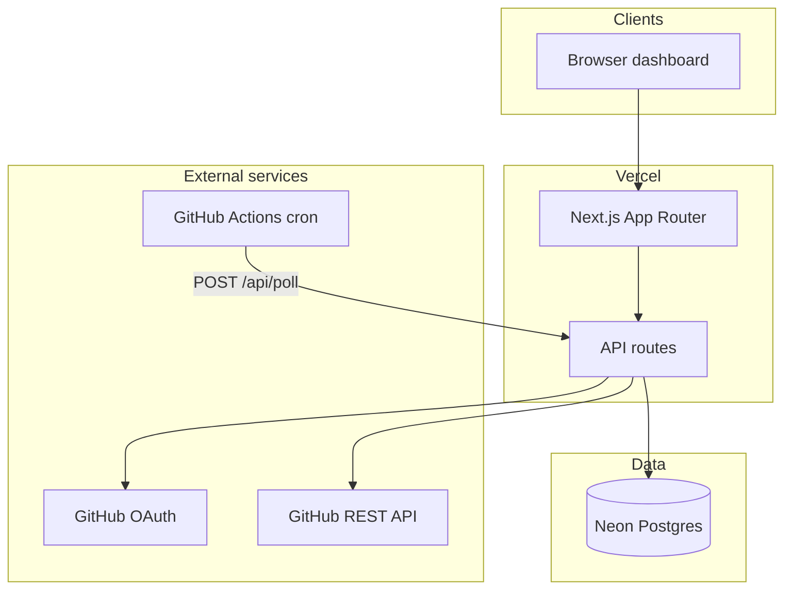
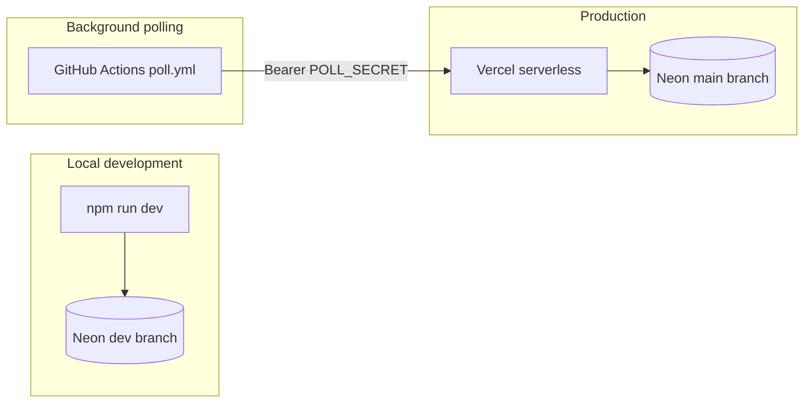
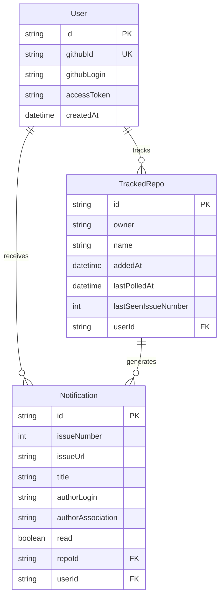
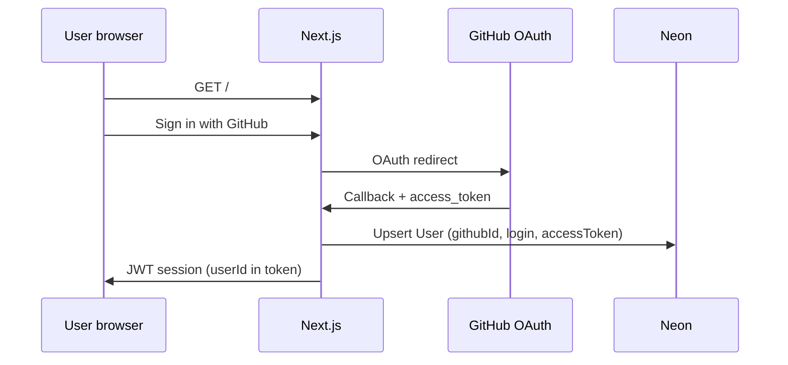
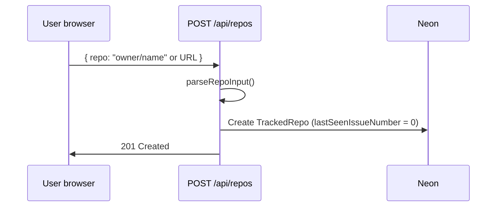
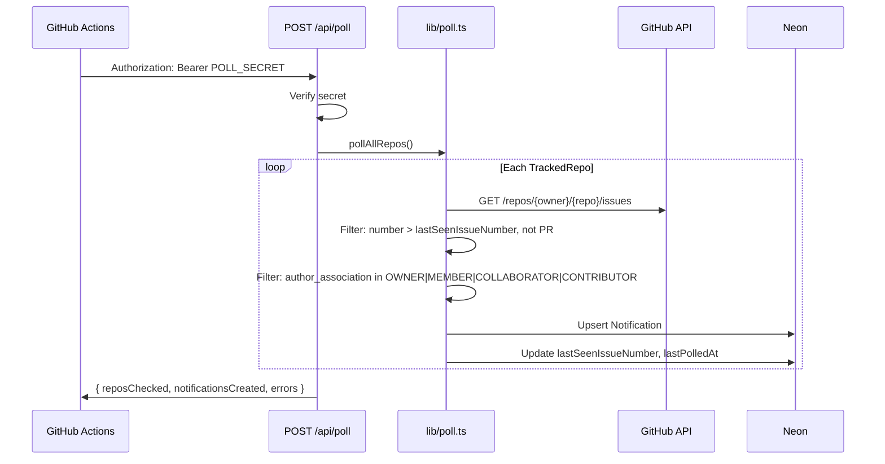
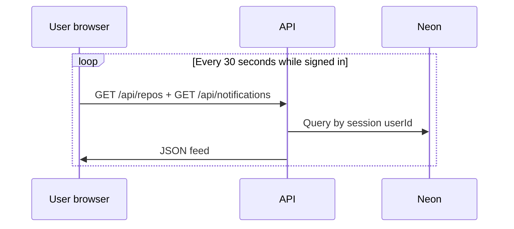
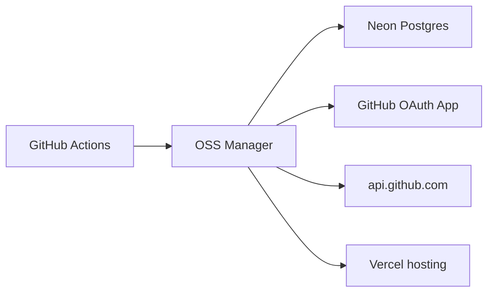

# System architecture

OSS Contribution Manager is a Next.js web app that lets users track GitHub repositories and receive a filtered notification feed when maintainers or past contributors open new issues.

## High-level overview



| Layer | Technology | Role |
|-------|------------|------|
| Frontend | Next.js 14, React, Tailwind | Single-page dashboard at `/` |
| API | Next.js Route Handlers | Auth, repos, notifications, poll trigger |
| Auth | NextAuth v4 + GitHub OAuth | Sign-in, JWT sessions, token storage |
| Database | Prisma + Neon Postgres | Users, tracked repos, notifications |
| Polling | GitHub Actions + `/api/poll` | Scheduled issue checks every 15 min |
| Hosting | Vercel | Serverless deployment |

## Deployment topology



- **Local:** `DATABASE_URL` points at a Neon **dev** branch.
- **Production:** Vercel env vars point at the Neon **main** branch.
- **Polling:** Does not run inside the app process by default — GitHub Actions POSTs to `/api/poll` on a cron schedule. Alternatively, run `npm run poll` locally or on any machine with DB access.

## Application layers

```
┌─────────────────────────────────────────────────────────┐
│  app/page.tsx              Dashboard UI (client)        │
│  app/providers.tsx         NextAuth SessionProvider     │
└────────────────────────────┬────────────────────────────┘
                             │ fetch /api/*
┌────────────────────────────▼────────────────────────────┐
│  app/api/                                               │
│    auth/[...nextauth]     GitHub OAuth (NextAuth)       │
│    repos/                 CRUD tracked repos            │
│    notifications/         List + mark read              │
│    poll/                  Trigger poll (secret-gated)   │
│    health/                Liveness check                │
└────────────────────────────┬────────────────────────────┘
                             │
┌────────────────────────────▼────────────────────────────┐
│  lib/                                                   │
│    auth.ts                NextAuth config + callbacks   │
│    db.ts                  Prisma client singleton       │
│    github.ts              GitHub API + author filter    │
│    poll.ts                Poll orchestration            │
└────────────────────────────┬────────────────────────────┘
                             │
┌────────────────────────────▼────────────────────────────┐
│  scripts/poll.ts           CLI entry → pollAllRepos()   │
└─────────────────────────────────────────────────────────┘
```

## Data model



**Key constraints:**
- One tracked repo per user per `owner/name` (`@@unique([userId, owner, name])`)
- One notification per repo per issue number (`@@unique([repoId, issueNumber])`)
- `lastSeenIssueNumber` on `TrackedRepo` is the poll cursor — only issues with a higher number are considered

## Core flows

### 1. Sign in



- Session strategy is **JWT** (not database sessions).
- The GitHub `access_token` is stored on `User` and reused for authenticated GitHub API calls during polling (higher rate limits, private repo access).

### 2. Add a tracked repo



New repos start with `lastSeenIssueNumber = 0`, so the first poll only captures **future** issues — not historical ones.

### 3. Scheduled poll (production)



**Filter logic** lives in `lib/github.ts` (`MAINTAINER_ASSOCIATIONS`). Issues from `NONE`, `FIRST_TIMER`, etc. are silently skipped.

### 4. Dashboard refresh



Mark-as-read: `POST /api/notifications/[id]/read` on hover.

## API surface

| Route | Method | Auth | Purpose |
|-------|--------|------|---------|
| `/api/auth/[...nextauth]` | GET/POST | — | GitHub OAuth flow |
| `/api/repos` | GET | Session | List user's tracked repos |
| `/api/repos` | POST | Session | Add repo |
| `/api/repos/[id]` | DELETE | Session | Remove repo |
| `/api/notifications` | GET | Session | Latest 100 notifications |
| `/api/notifications/[id]/read` | POST | Session | Mark notification read |
| `/api/poll` | POST | `Bearer POLL_SECRET` | Run poll job |
| `/api/health` | GET | — | `{ ok: true }` liveness |

## Security boundaries

| Asset | Protection |
|-------|------------|
| User sessions | NextAuth JWT encrypted with `NEXTAUTH_SECRET` |
| Poll endpoint | Shared secret `POLL_SECRET` (header check) |
| GitHub tokens | Stored in Postgres on `User.accessToken` |
| Database | Neon connection over TLS; pooled URL for runtime, direct for migrations |

**OAuth scopes:** `read:user repo` — enough to read user profile and repo issues (including private repos the user can access).

## External dependencies



| Service | Required for | Free tier |
|---------|--------------|-----------|
| Neon | Persistent data | Yes |
| GitHub OAuth | User sign-in | Yes |
| GitHub API | Issue fetching | 5000 req/hr (authenticated) |
| Vercel | Production hosting | Yes |
| GitHub Actions | Scheduled polling | Yes (public repos) |

## Design decisions

1. **Poll via HTTP cron, not in-process timer** — Vercel serverless has no long-running workers; GitHub Actions (or external cron) triggers `/api/poll`.
2. **Per-user GitHub tokens for polling** — Uses each user's OAuth token so private repos and higher rate limits work without a global PAT.
3. **Issue number cursor** — Simple incremental polling; no webhook infrastructure required.
4. **Author association filter** — Uses GitHub's built-in `author_association` field instead of maintaining a contributor allowlist.
5. **Single dashboard page** — MVP UI in `app/page.tsx`; no separate component library yet.

## Related docs

- [Setup guide](setup.md) — provisioning Neon, OAuth, Vercel, and Actions
- [Environment variables](../.env.example) — full env template
